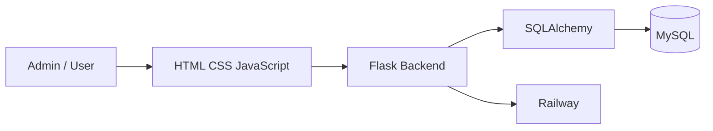

# 🎓 College Management & Administration System

A full-stack college ERP and administration platform built to centralize institutional workflows. The system streamlines student admissions, academic management, attendance tracking, fee collection, examinations, library operations, transport logistics, targeted notices, reports, and system configuration into a single unified interface.

[](https://www.python.org/)
[](https://flask.palletsprojects.com/)
[](https://www.mysql.com/)
[](https://www.docker.com/)
[](https://railway.app/)
[](LICENSE)

---

## 🌐 Live Demo

🚀 **[College Management & Administration System — Live Demo](https://college-admission-system-pmtz.onrender.com)**

---

## ✨ Features

### 🎓 Student & Admission Management
- Admission application processing and verification
- Official student records and profile management
- Unique institutional ZPRN generation (e.g., `124BT10420`)
- Multi-criteria student search and filtering
- Academic year, year of study, and semester organization

### 🏛️ Academic Management
- Department and intake capacity management
- Course and degree program administration
- Daily attendance tracking and low-attendance alerts (<75%)
- Examination scheduling (Mid-term, End-term, Internal)
- Subject creation, marks entry, and result computation

### 💰 Fees & Payments
- Program-wise fee structure configuration
- Individual student fee ledgers
- Multi-mode payment recording (UPI, Net Banking, Cards, DD, Cash)
- Payment history and downloadable PDF receipts
- Outstanding balance tracking and automated status updates

### 📚 Library
- Book cataloging and inventory management
- Book issue and return workflows
- Student and ZPRN verification before book issuance
- Transaction history, due dates, and fine tracking

### 🚌 Transport
- Vehicle and fleet profile management
- Route, stop, and timing administration
- Student bus allocation and pass records

### 📢 Notices
- Create, publish, draft, and schedule notices
- Departmental and role-based audience targeting
- High-priority and pinned bulletins
- Notice expiration and archiving

### 📊 Reports & Analytics
- Executive dashboard with institutional summary cards
- Student enrollment and demographic distribution
- Admission conversion and status metrics
- Attendance trends and examination performance analysis
- Fee collection summaries and financial reports

### ⚙️ System Settings
- Institution branding and college information
- Academic session and semester parameters
- Administrator accounts with secure password hashing
- SMTP notification and email settings
- System preferences and diagnostics

---

## 🖥️ Dashboard

- **Student Statistics**: Total enrolled students across departments and demographic breakdowns.
- **Admissions**: Application pipeline status, pending verifications, and approvals.
- **Attendance**: Institutional attendance rates with low-attendance warnings.
- **Fees**: Total collection metrics, outstanding balances, and recent payments.
- **Administrative Quick Actions**: Shortcuts to verify students, record payments, mark attendance, and post notices.
- **Analytics**: Real-time visual charts for admissions, departments, and financial summaries.

---

## 🛠️ Tech Stack

| Category | Technology |
|---|---|
| Frontend | HTML, CSS, JavaScript |
| Backend | Python, Flask |
| Database | MySQL |
| ORM | SQLAlchemy / Flask-SQLAlchemy |
| Containerization | Docker |
| Deployment | Railway |
| Version Control | Git & GitHub |

---

## 🏗️ Architecture



---

## 📁 Project Structure

```text
College-Admission-System/
├── .github/
│   └── workflows/
│       └── main.yml
├── backend/
│   ├── config/
│   ├── models/
│   ├── routes/
│   ├── services/
│   ├── tests/
│   ├── utils/
│   ├── app.py
│   └── wsgi.py
├── frontend/
│   ├── images/
│   ├── index.html
│   ├── login.html
│   ├── student-login.html
│   ├── student-dashboard.html
│   ├── view.html
│   ├── script.js
│   ├── student.js
│   ├── view.js
│   └── style.css
├── Dockerfile
├── docker-compose.yml
├── requirements.txt
├── .env.example
├── .gitignore
└── README.md
```

---

## 🚀 Getting Started

### 1. Prerequisites
- Python 3.11+
- MySQL Server 8.0+
- Git

### 2. Local Setup
```bash
# Clone repository
git clone https://github.com/your-username/College-Admission-System.git
cd College-Admission-System

# Create and activate virtual environment
python -m venv venv
# On Windows: venv\Scripts\activate
# On Linux/macOS: source venv/bin/activate

# Install dependencies
pip install -r requirements.txt

# Configure environment variables
cp .env.example .env

# Run development server
python backend/app.py
```

### 3. Docker Setup
```bash
docker-compose up --build
```

---

## 📄 License

This project is licensed under the **MIT License**.
